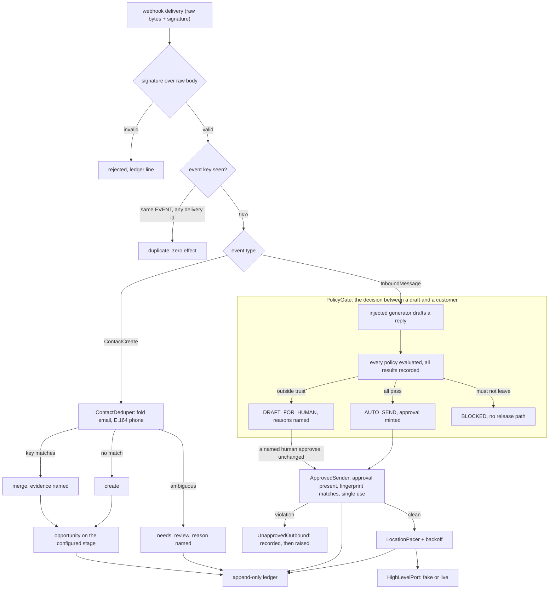

# ghl-bridge

[](https://github.com/vinimabreu/ghl-bridge/actions/workflows/ci.yml)


A CRM automation that guesses is a liability. The bridge validates before it writes, dedupes before it creates, respects the platform's rate limits, and no message leaves for a customer without a named approval path. All of it proven offline, deterministically, with no account and no key.

This is the CRM sibling of [make-failsafe](https://github.com/vinimabreu/make-failsafe) (the same reliability doctrine applied to Make.com scenarios) and [confidence-gate](https://github.com/vinimabreu/confidence-gate) (the same auto-or-human decision applied to extraction output). The three share one thesis: automation earns autonomy per action, and everything else goes to a human with the reason named.

One runtime dependency (pydantic). The reply generator is an injected callable, the workspace ships as a deterministic fake modelling the documented API 2.0 semantics, and the whole suite runs offline: no network, no credential, no API key, no model.

## What this is built against, stated plainly

There is no GoHighLevel account behind this repository. The contract is implemented against the public HighLevel API 2.0 documentation (`services.leadconnectorhq.com`, Private Integration token or marketplace OAuth, `Version` headers per endpoint family), and `ghl_bridge.fakes.FakeHighLevel` models the documented semantics: location-scoped tokens, upsert matching inside the location, ordered pipeline stages, calendars that refuse double bookings, and the published rate limits (100 requests per 10 seconds and 200,000 per day, per location) answered as a 429 with the documented headers.

A live adapter ships behind `pip install "ghl-bridge[live]"` and implements the same port. Its URL building, headers and error mapping are fully unit tested offline; what has not happened is a run against a live workspace. Field names are encoded from the public API 2.0 docs; verify against a live workspace via the [RUNBOOK](RUNBOOK.md), which lists the exact smoke sequence for the day a token exists. Where the docs left room for doubt, the specific function's docstring says so instead of pretending precision. The three thinnest spots are named in "What this is not" below.

## The bug class this exists to prevent

Every row is an executable test in this repository, not a paragraph of prose:

| The guess | What it costs in production | The test that refuses it |
| --- | --- | --- |
| Idempotency keyed on the webhook delivery | Every sender retry double-creates the lead and double-sends the message | `test_the_same_event_redelivered_has_exactly_one_effect` |
| `str.lower()` as an email dedupe key | U+212A KELVIN SIGN folds onto `k`: two distinct addresses become one contact, irreversibly | `test_the_kelvin_anchor_two_spellings_do_not_merge` |
| Guessing a country code for a bare phone number | Two strangers merge into one record with one conversation history | `test_the_anchor_a_bare_national_number_with_no_region_is_never_guessed` |
| Auto-replying whenever the model answers | Messages leave at 21:40, quote prices, and answer STOP with marketing | `test_after_hours_parks_the_draft_with_the_reason_named`, `test_replying_to_a_stop_blocks` |
| Trusting the wiring to always pass the gate | One refactor later, unapproved text reaches customers silently | `test_killing_the_gate_is_caught_by_the_guard_not_by_luck` |
| Firing requests until the platform pushes back | 429 cascades, failed syncs, a banned integration | `test_a_burst_of_calls_waits_instead_of_erroring` |
| Booking whatever slot looks free | Two customers arrive for one appointment | `test_double_booking_the_same_slot_is_refused` |
| Moving an opportunity to a remembered stage id | Deals filed into a stage that no longer exists, invisibly | `test_create_opportunity_refuses_a_stage_from_nowhere` |

## The shape of the bridge



The gate in the middle is the heart. The generator is a plain `Callable[[GenerationRequest], str]` and this package holds no opinion about what produces the draft. It holds a strong opinion about what happens next, and that opinion is deterministic: string rules and clock arithmetic decide, never a second model checking the first.

## The offline demo

```bash
pip install -e ".[dev]"
python -m examples.bridge_demo
```

One synthetic location, one afternoon, every decision named. Everything below is a verbatim capture of that command, asserted byte for byte by `tests/test_example_demo.py` on every CI run, so this section cannot quietly drift from the code.

<!-- demo:begin -->
```
ghl-bridge  |  policy-gated CRM automation, proven offline against the fake workspace
================================================================================================
Location Riverbend Detailing (loc-riverbend), America/Chicago, answers Mon-Fri 09:00-18:00. All data synthetic.
Pipeline Sales: New Lead -> Qualified -> Booked. Existing contact con-0001: Dana Whitfield, dana@riverbend.example, +15005550100.
Private Integration token pit-0001 is scoped to loc-riverbend; every call below rides it.

1. 14:00, a form lead arrives by webhook, shoutier spelling and all
------------------------------------------------------------------------------------------------
payload email:  ' DANA@Riverbend.example '
dedupe key:     'dana@riverbend.example'  (ASCII fold + trim, never str.lower)
decision:       merged into existing con-0001 on email; no duplicate contact created
opportunity:    opp-0001 filed in stage 'New Lead' of pipeline Sales

2. 14:03, Dana asks a scheduling question, inside business hours
------------------------------------------------------------------------------------------------
inbound:  "What times do you have on Thursday?"
draft:    "Hi Dana, the next open detailing slots are Thursday morning. Reply with a time that suits you and I will book it."
the gate evaluates every policy, and every result goes on the record:
  contact_not_opted_out        pass   the contact accepts messages
  not_a_reply_to_opt_out       pass   inbound intent is 'scheduling'
  draft_not_empty              pass   the draft has content
  no_payment_details_request   pass   the draft asks for no payment details
  within_business_hours        pass   local time is Tue 14:03 (America/Chicago); inside the answering window
  intent_covered               pass   intent 'scheduling' is on the covered list
  no_price_commitment          pass   the draft makes no price commitment
  draft_length                 pass   113 chars against a limit of 640
outcome:  AUTO_SEND under approval dec-0001; msg-0002 left for con-0001

3. 21:40, another question, outside business hours
------------------------------------------------------------------------------------------------
inbound:  "can you fit me in tomorrow?"
outcome:  DRAFT_FOR_HUMAN, reason named: ['within_business_hours']
          local time is Tue 21:40 (America/Chicago); outside the answering window
parked:   decision dec-0002 waits in the review queue
released: sam@riverbend.example approved it unchanged; msg-0004 left under a human approval

4. 21:41, the lead webhook is redelivered (sender timeout, fresh delivery id)
------------------------------------------------------------------------------------------------
delivery dlv-004 carries the same event id:evt-lead-001; first processed under dlv-001
effects:  contacts merged 1, opportunities created 1 (both unchanged; idempotency keys on the EVENT, never the delivery)

5. rate discipline, limits scaled down (burst 4 per 10s) so the arithmetic is visible
------------------------------------------------------------------------------------------------
  call  1: waited   0.0s before sending
  call  2: waited   0.0s before sending
  call  3: waited   0.0s before sending
  call  4: waited   0.0s before sending
  call  5: waited  10.0s before sending
  call  6: waited   0.0s before sending
  call  7: waited   0.0s before sending
  call  8: waited   0.0s before sending
  call  9: waited  10.0s before sending
  call 10: waited   0.0s before sending
ten calls against a burst of four: 2 computed waits, 20.0s of scripted clock, zero 429s surfaced to the caller

6. the audit answer: why did msg-0002 leave on its own at 14:03?
------------------------------------------------------------------------------------------------
  14:03  webhook_received   event id:evt-msg-001 via delivery dlv-002
  14:03  draft_generated    113 chars drafted for con-0001
  14:03  gate_decision      dec-0001 -> auto_send (all policies passed)
  14:03  message_sent       msg-0002 to con-0001 under auto approval

records: 15    guard breaches: 0    pending drafts: 0
```
<!-- demo:end -->

Worth reading twice in that capture: the 21:40 message did leave, but only after `sam@riverbend.example` put a name on it, and the ledger's final line answers the question every operator eventually asks about an automation: why did that message send itself, and on whose say-so.

## Identity: the dedupe keys and what they refuse

A merge is irreversible in every way that matters, so the keys that trigger one follow two rules.

**Email folds ASCII case only.** `str.lower()` and `str.casefold()` apply the Unicode folding tables, which are many-to-one across characters that are not case variants of each other: U+212A KELVIN SIGN folds to `k`, U+00DF SHARP S to `ss`, U+FB01 LIGATURE FI to `fi`, U+017F LONG S to `s`. Any of those merges two separately real addresses into one dedupe key before a single comparison happens. Folding `A-Z` alone cannot merge two distinct characters. The trim is ASCII-only for the same reason, and an invisible character is a loud `InvalidEmail` naming the code point, because printing the character shows nothing. The stated cost: non-ASCII case pairs stay distinct, which fails toward a duplicate a human can merge rather than a silent merge nobody can split.

**Phone is deterministic E.164 or an explicit refusal.** A `+` number passes on its own terms. A bare national number resolves only through the location's configured region and a small explicit numbering-plan table (trunk zeros handled where the plan has them, the BR mobile 9 handled by name). No region, a region outside the table, a digit count the plan does not admit: the result is a `PhoneNeedsReview` value carrying the raw input and the named reason, routed to a human queue on purpose. It is not an exception and not a best-effort create, because guessing a country merges strangers.

When email and phone point at two different existing contacts, the deduper refuses that too. Either merge is a guess about which record is the person.

## Webhooks: the event is the identity, the delivery is not

Webhook senders retry. A timeout, a 502, a redeploy, and the same event arrives again under a fresh delivery id. Key the dedupe on the delivery and every retry is a brand-new fact: the lead double-creates, the stage double-moves, the customer gets the same message twice. So `event_key` prefers the platform's own event id and otherwise derives from the event's identity fields (type, location, resource, occurrence time), never from the delivery attempt. `test_a_fresh_delivery_id_never_changes_the_key` is one line and it is the whole argument.

Two other choices worth their sentences. The signature is verified over the raw bytes before any parsing, and the scheme is an injected seam: the shipped `HmacSha256Scheme` is what the offline build can prove end to end, while the HighLevel marketplace documents a platform-signed header for app webhooks whose verifier plugs into the same `SignatureScheme` protocol (the RUNBOOK carries the confirmation step). And the dedupe key is marked seen only after the handler completes: a handler that raises leaves the key unmarked, so the sender's retry gets to finish the work instead of hitting a poisoned key, and the failed attempt is a ledger line (`test_a_failing_handler_does_not_poison_the_event_key`).

## The gate: three outcomes, all of them named

| Outcome | When | What happens |
| --- | --- | --- |
| `AUTO_SEND` | Every policy passes | The gate mints the approval itself; the ledger shows exactly which checks vouched |
| `DRAFT_FOR_HUMAN` | Nothing dangerous, but outside what the automation is trusted with alone | The draft parks with the failing policies named; a named human can release it unchanged |
| `BLOCKED` | The content must not leave | No release path exists, deliberately |

The shipped policies: the contact has not opted out; the inbound is not itself an opt-out (the only correct reply to STOP is the platform's own confirmation); the draft is not empty; the draft asks for no payment details over SMS; local time is inside the location's answering window (opening instant inclusive, closing instant exclusive, both pinned by test, DST handled by real zone arithmetic); the intent is on the covered list; the draft commits to no price or promise; the draft fits the length budget.

Two design points that carry weight. Every policy is evaluated and every result is recorded, passes included, because "which checks did this send clear" is an audit question and recomputing it later against changed rules is not an answer. And a block outranks any number of draft failures with no human release path, because a release path for blocked content turns every block into a nag that eventually gets clicked through.

The approval is not a boolean. It binds to a fingerprint of contact, channel and exact body: approve one text and send another, and the send fails. It is single-use: a retry loop replaying one approval across many sends fails on the second.

## The guard: redundancy that fails loud

In a correct wiring `ApprovedSender` never fires: the bridge only sends what the gate stamped. It stays because the bridge is one refactor away from not being the only caller: a bulk script, a "quick fix" against the port, a retry path that rebuilds the send and forgets the stamp. The mutation test does exactly that, subclassing the bridge so the gate is dead, and proves the unapproved send stops at the guard with a `guard_breach` ledger line recorded before `UnapprovedOutbound` is raised. It raises instead of dropping, because a silent drop hides a real bug in the layer above while the system keeps looking healthy.

The fake enforces its own redundancy from the platform side: a send to a DND contact is refused by `FakeHighLevel` itself, the way the platform refuses it, so the opt-out protection holds even if every layer above it were wrong.

## Rate limits: pace first, back off second, never guess

The published limits live in one module (`ghl_bridge.limits`) imported by both sides of the contract: the fake that enforces them and the pacer that respects them. The client keeps a sliding window per location and computes the exact wait that keeps the next call safe; a sliding window admitting N per interval can never exceed a fixed-window server admitting N per window, however the server's window is aligned, so pacing is conservative by construction. When a 429 arrives anyway (another process on the same token), the caller waits the platform's own number from the response headers, retries within a bounded budget, and records every wait and retry in the ledger. Time never passes silently: waiting goes through an injected `Sleeper`, which is why the suite has zero real sleeps and the demo's twenty seconds of waiting cost nothing.

## The ledger: why did that message send at 14:03

Append-only, frozen records, sequence assigned inside, no update and no delete on the surface. Every outbound action carries its origin event key, the full policy evaluation, the approval it travelled under and the clock reading. `explain_message(message_id)` walks the chain back and returns the story in order: webhook received, draft generated, gate decision with every policy, message sent under a named approval. Section 6 of the demo is that call, verbatim.

## What this is not

- **Not a live integration, yet.** No workspace, no token, no live call has been made. The live adapter's logic is tested offline against recorded shapes; the [RUNBOOK](RUNBOOK.md) is the checklist that turns it on honestly.
- **Not a claim of exact wire shapes everywhere.** Three spots are thinner than the rest and say so in their docstrings: the contact lookup endpoint (the docs show both a query lookup and a newer search body), the free-slots response grouping (slots keyed by date, slot length not in the response), and the marketplace webhook signature scheme (a platform-signed header, seam provided, verifier pending a live app). Everything else follows the documented camelCase fields and `Version` headers.
- **Not a generator.** Nothing in this package produces text. The seat is a typed callable, the demo fills it with a template, and the gate judges whatever sits there by its output alone.
- **Not a multi-tenant control plane.** One bridge serves one location, which mirrors how a Private Integration token is scoped. Fan-out across locations is composition, not configuration.

## Install and verify

```bash
pip install -e ".[dev]"
ruff check .          # clean
mypy                  # strict, clean
pytest                # 366 tests, offline, no sleeps
python -m examples.bridge_demo
```

Or the container, which builds the package and runs the same demo:

```bash
docker build -t ghl-bridge .
docker run --rm ghl-bridge
```

## License

MIT. See [LICENSE](LICENSE).
